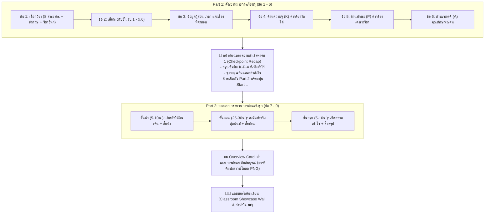

# 🎒 Lesson Plan Studio (ห้องทดลองออกแบบแผนการสอนสำหรับน้องๆ ม.6)

เว็บแอปพลิเคชันออกแบบแผนการจัดการเรียนรู้เชิงรุก (Active Learning) ที่ **ย่อยเป็นสเต็ปเล็กๆ (Bite-sized Steps) สะอาดตา ไม่ทำให้เด็กตกใจ** พัฒนาขึ้นเป็นพิเศษสำหรับกิจกรรมค่าย/Workshop เตรียมความพร้อมความเป็นครูของนักเรียนชั้นมัธยมศึกษาปีที่ 6

---

## 🌟 จุดเด่นและโครงสร้างใหม่ของระบบ

### 1. แบ่ง 2 พาร์ทชัดเจน พร้อม "หน้าคั่นเปิดตัว (Intermission Checkpoint)" 🎉
เพื่อไม่ให้เด็กรู้สึกเหนื่อยหรือยาวเกินไป ระบบได้แบ่งการทำงานออกเป็น 2 พาร์ทหลัก พร้อมหน้าพักคั่นฉลองความสำเร็จ:



---

### 2. ดีไซน์ตามความต้องการของเด็ก ม.6 (UX/UI Friendly)
1. **Placeholder สีเทาอ่อน (ไม่ใช่สีดำหลอกตา)**: ช่องพิมพ์ทุกช่องแสดงตัวอย่างด้วยสีเทา เพื่อให้น้องๆ รู้ทันทีว่าต้องพิมพ์เอง
2. **ตัวอย่างเปลี่ยนตามวิชาอัตโนมัติ**: เมื่อเลือกวิชาภาษาอังกฤษ ตัวอย่างหัวข้อ, K, P, A และสื่อจะสลับเป็นของวิชาภาษาอังกฤษทันที
3. **คลิกเพื่อแทนที่ (Replace แทนการต่อท้าย)**: เวลาเด็กคลิกไอเดียคำแนะนำ ระบบจะนำไปแทนที่ในช่องทันที ป้องกันข้อความยาวพันกัน
4. **คำนวณและเกลี่ยเวลาอัตโนมัติ**: กำหนดเวลา เช่น 50 นาที ระบบจะจัดสรรเป็น *ขั้นนำ 10น. + ขั้นสอน 30น. + ขั้นสรุป 10น.* ให้อัตโนมัติ

---

### 3. 🔥 การเชื่อมต่อ Firebase Real-time (พร้อมใช้งาน 100%)

ระบบเตรียมไฟล์ [`js/firebase-service.js`](file:///d:/SKY/Workshop%20EDU/js/firebase-service.js) ไว้รองรับแล้ว โดยมีระบบ **Offline Fallback** ด้วย LocalStorage ทำงานเป็นค่าเริ่มต้น

#### ขั้นตอนการเชื่อมต่อ Firebase Cloud:
1. ไปที่ [Firebase Console](https://console.firebase.google.com/) แล้วสร้างโปรเจกต์ใหม่ (หรือเลือกโปรเจกต์เดิม)
2. ไปที่ **Project Settings (ฟันเฟือง)** ➔ เลื่อนลงไปที่หัวข้อ **"Your apps"** ➔ คลิกไอคอนเว็บ (`</>`) ➔ คัดลอกอ็อบเจกต์ `firebaseConfig`
3. เปิดไฟล์ [`js/firebase-service.js`](file:///d:/SKY/Workshop%20EDU/js/firebase-service.js) แล้วนำคีย์มาวางในตัวแปร:
   ```javascript
   const FIREBASE_CONFIG = {
     apiKey: "AIzaSy...",
     authDomain: "your-project.firebaseapp.com",
     projectId: "your-project",
     storageBucket: "your-project.appspot.com",
     messagingSenderId: "123456789",
     appId: "1:123456789:web:abcdef..."
   };
   ```
4. ใน Firebase Console ไปที่เมนู **Firestore Database** ➔ คลิก **Create database** ➔ เลือกโหมด **Test mode** (หรือกำหนด Rules ให้ `classroom_plans` อ่านเขียนได้)
5. **เสร็จสิ้น!** เมื่อเด็กนักเรียนกดส่งแผน แผนจะถูกยิงขึ้น Cloud Firestore และแดชบอร์ดหน้าจอของครูจะอัปเดตแบบ Real-time ทันที พร้อมระบบกดหัวใจ ❤️ ข้ามเครื่องได้ทันที

---

## 📁 โครงสร้างโปรเจกต์

```text
d:\SKY\Workshop EDU/
├── index.html               # หน้าเว็บหลัก (Single-Step Wizard, Checkpoint, Overview, แดชบอร์ด)
├── css/styles.css           # สไตล์ 3D Drop-Shadows, เส้นขอบม่วงเด่นชัด, ฟอนต์ Prompt & Kanit
├── js/data.js               # ฐานข้อมูล 10 วิชา, 12 ระดับชั้น, หัวข้อ สสวท., Measurable Verbs
├── js/firebase-service.js   # Service เชื่อมต่อ Firebase Firestore Real-time + Fallback
├── js/app.js                # Controller หลัก จัดการลำดับขั้นตอน คำนวณเวลา และการนำทาง
└── README.md                # เอกสารคู่มือโครงการ
```

---

## 🚀 วิธีเปิดใช้งาน
1. เข้าไปที่โฟลเดอร์ `d:\SKY\Workshop EDU`
2. ดับเบิลคลิกไฟล์ [**`index.html`**](file:///d:/SKY/Workshop%20EDU/index.html)
3. ใช้งานผ่านเบราว์เซอร์ (Google Chrome, Edge, Safari) ได้ทันที!
